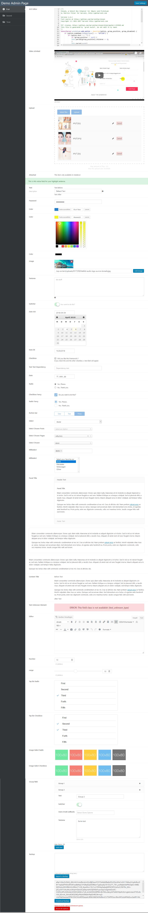

# Exopite-Simple-Options-Framework

## Fast, easy and lightweight option/metabox form generator.

- Author: Joe Szalai
- Version: 20180406
- Plugin URL: https://joe.szalai.org/exopite/exopite-simple-options-framework/
- GitHub URL: https://github.com/JoeSz/Exopite-Simple-Options-Framework
- Author URL: https://joe.szalai.org
- License: GNU General Public License v3 or later
- License URI: http://www.gnu.org/licenses/gpl-3.0.html

> ### NOTE
>
> The Framework still in development stage. <br />
> Documentation is still in-progress.
>
> The Framework based on some CodeStar Framework, MetaBox.io code and design. The fields configs desgin also based on CodeStar Framework.
I created this framework for plugins and metaboxes. Not for Themes. For Themes I recommend CodeStar Framework.

### DESCRIPTION

WHY?
I need someting fast, easy and lightweight to generate option page and/or metabox for my plugins and/or post types.

I also love to create/code to have fun and leary every day someting new.

For my theme I use CodeStar Framework, so I created similarly. Unfortunately CodeStar Framework based on static class, can not initialize multiple times and this is required for plugns.

#### Lightweight

No ads, Files are loaded only when required. Minimum footprint.

#### Integration

Easy to integrate with any plugin or post type (even WordPress theme, but it is not designed to do so).

#### Open Source

Exopite Simple Options is free and available on Github. Feel free to submit patches or add more features.

### FEATURES

- Easy field generator for plugin options for metabox for any post type.
- All field support callback on default value, content callback for content and notice field.
- Dependency handling, also for section tabs (only in tabbed=true).
- No ads, and never will.
- Files are loaded only when required.
- Minimum footprint.

### Fields:
- ACE editor
- attached (Attached files/images/etc..., multiselect, AJAX delete. Metabox only.)
- backup
- button
- button_bar
- card
- checkbox
- color  (rgb/rgba/html5)
- content
- date   (datepicker/html5)
- editor (Trumbowyg or WYSIWYG WordPress Editor)
- group  (Dynamically add groups. Repeatable and sortable (on/off). All fields are valid, except: group itself)
- hidden
- image
- image_select
- meta
- notice
- number
- password
- radio
- range
- select (single/multiselect + posttype)
- switcher
- tap_list
- text
- textarea
- upload (multiple, on post type -post, page, custom- you can attach uploaded to post)
- video (mp4/oembed, eg.: youtube)

### REQUIREMENTS

Server

* WordPress 4.9+ (May work with earlier versions too)
* PHP 5.6+ (Required)
* jQuery 1.9.1+

Browsers

* Modern Browsers
* Firefox, Chrome, Safari, Opera, IE 10+
* Tested on Firefox, Chrome, Edge, IE 11

### INSTALLATION

* Copy to plugin/theme folder.
* Indluce exopite-simple-options/exopite-simple-options-framework-class.php
* Create options and fields nad hook to 'init'.

#### Complete example with all available fields:
https://github.com/JoeSz/WordPress-Plugin-Boilerplate-Tutorial/blob/f8b70137c1beb3fc6f087f185418d51bef85a1bc/plugin-name/admin/class-plugin-name-admin.php#L117

#### Example:
```php
/**
 * Create a submenu page under Plugins.
 * Framework also add "Settings" to your plugin in plugins list.
 * @link https://github.com/JoeSz/Exopite-Simple-Options-Framework
 */
$config_submenu = array(
    'type'              => 'menu',                          // Required, menu or metabox
    'id'                => $this->plugin_name,              // Required, meta box id,
                                                            // unique per page, to save:
                                                            // get_option( id )
    'menu'              => 'plugins.php',                   // Required, sub page to your options page
    'submenu'           => true,                            // Required for submenu
    'title'             => 'Demo Admin Page',               //The name of this page
    'capability'        => 'manage_options',                // The capability needed to view the page
    'plugin_basename'   =>  plugin_basename( plugin_dir_path( __DIR__ ) . $this->plugin_name . '.php' ),
    // 'tabbed'            => false,                        // is tabbed or not
                                                            // Note: if only one section then
                                                            // Tabs are disabled.
);

/*
 * To add a metabox.
 * This normally go to your functions.php or another hook
 */
$config_metabox = array(
    /*
     * METABOX
     */
    'type'              => 'metabox',
    'id'                => $this->plugin_name . '-meta',
    'post_types'        => array( 'post', 'page' )    // Post types to display meta box
    'context'           => 'advanced',
    'priority'          => 'default',
    'title'             => 'Demo Metabox',
    'capability'        => 'edit_posts',              // The capability needed to view the page
    'tabbed'            => true,
);

$fields[] = array(
    'name'   => 'first',
    'title'  => 'Section First',
    'fields' => array(

        // fields...

        array(
            'id'      => 'unique_id_1',
            'type'    => 'switcher',
            'title'   => 'Field title',
            'default' => 'yes',
        ),

    ),
);

$fields[] = array(
    'name'   => 'second',
    'title'  => 'Section Second',
    'fields' => array(

        // fields...

        array(
            'id'      => 'unique_id_2',
            'type'    => 'switcher',
            'title'   => 'Field title',
            'default' => 'yes',
        ),

    ),
);

$options_panel = new Exopite_Simple_Options_Framework( $config_submenu, $fields );
$metabox_panel = new Exopite_Simple_Options_Framework( $config_metabox, $fields );
```




### HOOKS

#### Filters
exopite-simple-options-framework-config (config)
exopite-simple-options-framework-options (fields)
exopite-simple-options-framework-menu-get-options (options, unique)
exopite-simple-options-framework-save-options (valid, unique)
exopite-simple-options-framework-save-menu-options (valid, unique)
exopite-simple-options-framework-save-meta-options (valid, unique)
exopite-simple-options-framework-sanitize-value (value, config)
exopite-simple-options-framework-add-field (output, field, config )
exopite-simple-options-framework-meta-get-options (meta_options, unique, post_id )

#### Actions
exopite-simple-options-framework-do-save-options (valid, unique)
exopite-simple-options-framework-do-save-menu-options (value, unique)
exopite-simple-options-framework-do-save-meta-options (valid, unique, post_id)
exopite-simple-options-framework-before-generate-field (field, config)
exopite-simple-options-framework-before-add-field (field, config)
exopite-simple-options-framework-after-generate-field (field, config)
exopite-simple-options-framework-after-add-field (field, config)
exopite-simple-options-framework-form-menu-before (unique)
exopite-simple-options-framework-form-meta-before (unique)
exopite-simple-options-framework-display-page-header (config)
exopite-simple-options-framework-display-page-footer (config)
exopite-simple-options-framework-form-menu-after (unique)
exopite-simple-options-framework-form-meta-after (unique)

### CHANGELOG

= 20180219 - 2018-05-11 =
* Add loading class and hooks

= 20180429 - 2018-04-29 =
* add Trumbowyg editor to editor field
* allow TinyMCE in group field
* improve JavaScripts
* group can be sortable

= 20180219 - 2018-02-19 =
* Add SweetAlert (https://sweetalert.js.org/docs/)

= 20180114 - 2018-01-14 =
* Add backup and group/repeater field.

= 20180113 - 2018-01-13 =
* Add meta field.

= 20180107 - 2018-01-07 =
* Add button field.

= 20180102 - 2018-01-02 =
* Initial release.

### LICENSE DETAILS

The GPL license of Sticky anything without cloning it grants you the right to use, study, share (copy), modify and (re)distribute the software, as long as these license terms are retained.

### DISCLAMER

NO WARRANTY OF ANY KIND! USE THIS SOFTWARES AND INFORMATIONS AT YOUR OWN RISK!
[READ DISCLAMER.TXT!](https://joe.szalai.org/disclaimer/)
License: GNU General Public License v3

[](http://forthebadge.com) [](http://forthebadge.com)
