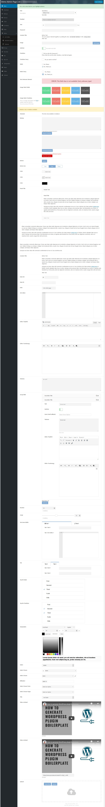
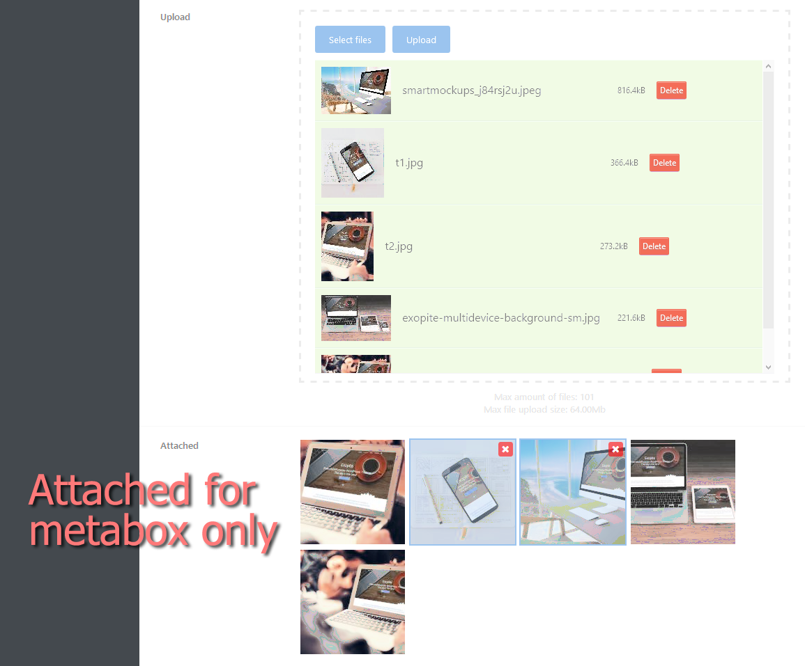

# Exopite-Simple-Options-Framework

Lightweight, easy to use Option Framework for WordPress Plugins and Themes and a Metabox Framework for post type meta boxes.

## Fast, easy and lightweight option/metabox form generator.

- Author: Joe Szalai and raoabid
- Version: 20190324
- Plugin URL: https://joe.szalai.org/exopite/exopite-simple-options-framework/
- GitHub URL: https://github.com/JoeSz/Exopite-Simple-Options-Framework
- Author URL: https://joe.szalai.org
- License: GNU General Public License v3 or later
- License URI: http://www.gnu.org/licenses/gpl-3.0.html

### DESCRIPTION

WHY?
I need someting fast, easy and lightweight to generate option page and/or metabox for my plugins, themes and/or post types.

I also love to create/code to have fun and leary every day someting new.

This framework not designed to work on mobiles. It is however working except sorting (https://caniuse.com/#feat=dragndrop) and chosen dropdown (only design, the dropdown still working).
I do not think that plugin or theme will be managed on mobile devices, tons of settings create a very loooong page in mobile, which - in my opinion -
already make unuseable in mobile devices.

For my theme I used to use CodeStar Framework, so I created similarly. Unfortunately CodeStar Framework based on static class, can not initialize multiple times and this is required for plugns. <br>
(Ps. the new CodeStar (2.x) can be used multiple times, but only Options Frameworks are free.)

#### Lightweight

No ads, Files are loaded only when required. Minimum footprint.

#### Integration

Easy to integrate with any plugin, post type or WordPress theme.

#### Open Source

Exopite Simple Options is free and available on Github. Feel free to submit patches or add more features.

### IMPORTANT
* As 2018-09-11 we have a new hooks name to meet WordPress standards.
* After multilanguage compatibility the <b>options array did changed.</b><br>
from `unique[field-id]` to `unique[current_lang][field-id]` where:<br>
if multilang plugin installed, then the selected language, otherwise WordPress installed language.<br>
You can disable this with `'multilang' => false` option.

> ### NOTE
>
> The Framework still in development stage. <br />
> Documentation is still in-progress.
>
> The Framework based on some CodeStar Framework, MetaBox.io code and design. The fields configs desgin also based on CodeStar Framework.

### FEATURES

- Easy field generator for plugin options for metabox for any post type.
- All field support callback on default value, content callback for content and notice field.
- Dependency handling, also for section tabs (only in tabbed=true).
- No ads, and never will.
- Files are loaded only when required.
- Minimum footprint.
- Multilang support for WPML, Polylang, WP Multilang and qTranslate-X.
- Availability to save post meta as simple (each setting has it's own custom field) istead of an array.

#### Why did we add options to save meta as "simple"
Simple options is stored az induvidual meta key, value pair, otherwise it is stored in an array.

I implemented this option because it is possible to search in serialized (array) post meta:
- https://wordpress.stackexchange.com/questions/16709/meta-query-with-meta-values-as-serialize-arrays
- https://stackoverflow.com/questions/15056407/wordpress-search-serialized-meta-data-with-custom-query
- https://www.simonbattersby.com/blog/2013/03/querying-wordpress-serialized-custom-post-data/

but there is no way to sort them with wp_query or SQL.

https://wordpress.stackexchange.com/questions/87265/order-by-meta-value-serialized-array/87268#87268<br>
> "Not in any reliable way. You can certainly ORDER BY that value but the sorting will use the whole serialized string,
> which will give * you technically accurate results but not the results you want. You can't extract part of the string
> for sorting within the query itself. Even if you wrote raw SQL, which would give you access to database functions like
> SUBSTRING, I can't think of a dependable way to do it. You'd need a MySQL function that would unserialize the value--
> you'd have to write it yourself.<br>
> Basically, if you need to sort on a meta_value you can't store it serialized. Sorry."

It is possible to get all required posts and store them in an array and then sort them as an array, but what if you want
multiple keys/value pair to be sorted?

UPDATE<br>
it is maybe possible:<br>
http://www.russellengland.com/2012/07/how-to-unserialize-data-using-mysql.html<br>
but it is waaay more complicated and less documented as meta query sort and search.
It should be not an excuse to use it, but it is not as reliable as it should be.

https://wpquestions.com/Order_by_meta_key_where_value_is_serialized/7908<br>
> "...meta info serialized is not a good idea. But you really are going to lose the ability to query your
> data in any efficient manner when serializing entries into the WP database.
>
> The overall performance saving and gain you think you are achieving by serialization is not going to be noticeable to
> any major extent. You might obtain a slightly smaller database size but the cost of SQL transactions is going to be
> heavy if you ever query those fields and try to compare them in any useful, meaningful manner.
>
> Instead, save serialization for data that you do not intend to query in that nature, but instead would only access in
> a passive fashion by the direct WP API call get_post_meta() - from that function you can unpack a serialized entry
> to access its array properties too."

### Fields:
- accordion
- ACE editor
- attached (Attached files/images/etc..., multiselect, AJAX delete. Metabox only.)
- backup
- button
- button_bar
- card
- checkbox
- color  (rgb/rgba/html5)
- content
- date   (datepicker/html5)
- editor (Trumbowyg or WYSIWYG WordPress Editor)
- fieldset
- group  (Dynamically add groups. Repeatable and sortable (on/off).)
- hidden
- image
- image_select
- meta
- notice
- number
- password
- radio
- range
- select (single/multiselect + posttype)
- switcher
- tab
- tap_list
- text
- textarea
- typography
- upload (multiple, on post type -post, page, custom- you can attach uploaded to post)
- video (mp4/oembed, eg.: youtube)

### REQUIREMENTS

Server

* WordPress 4.9+ (May work with earlier versions too)
* PHP 5.6+ (Required)
* jQuery 1.9.1+

Browsers

* Modern Browsers
* Firefox, Chrome, Safari, Opera
* Tested on Firefox, Chrome, Edge
* IE is not supported anymore
* jQuery Chosen and HTML5Sortable not working on mobile devices.
https://caniuse.com/#feat=dragndrop

### INSTALLATION

* Copy to plugin/theme folder.
* Indluce exopite-simple-options/exopite-simple-options-framework-class.php
* Create options and fields nad hook to 'init'.

#### Complete example with all available fields:
https://github.com/JoeSz/WordPress-Plugin-Boilerplate-Tutorial/blob/436ddfa388f0a99c6a6756fc3f8ba7a4e84d22f7/plugin-name/admin/class-plugin-name-admin.php#L117

#### Example:
##### Crete a menu or meta
```php
/**
 * Create a submenu page under Plugins.
 * Framework also add "Settings" to your plugin in plugins list.
 * @link https://github.com/JoeSz/Exopite-Simple-Options-Framework
 */
$config_submenu = array(
    'type'              => 'menu',                          // Required, menu or metabox
    'id'                => $this->plugin_name,              // Required, meta box id,
                                                            // unique per page, to save:
                                                            // get_option( id )
    'parent'            => 'plugins.php',                   // Required, sub page to your options page
    'submenu'           => true,                            // Required for submenu
    'title'             => 'Demo Admin Page',               //The name of this page
    'capability'        => 'manage_options',                // The capability needed to view the page
    'plugin_basename'   =>  plugin_basename( plugin_dir_path( __DIR__ ) . $this->plugin_name . '.php' ),
    // 'tabbed'            => false,                        // is tabbed or not
                                                            // Note: if only one section then
                                                            // Tabs are disabled.
    // 'multilang'         => false                         // Disable mutilang support, default: true

);

/*
 * To add a metabox.
 * This normally go to your functions.php or another hook
 */
$config_metabox = array(
    /*
     * METABOX
     */
    'type'              => 'metabox',
    'id'                => $this->plugin_name . '-meta',
    'post_types'        => array( 'post', 'page' )    // Post types to display meta box
    'context'           => 'advanced',
    'priority'          => 'default',
    'title'             => 'Demo Metabox',
    'capability'        => 'edit_posts',              // The capability needed to view the page
    // 'tabbed'            => false,                  // Add tabs or not, default true
    // 'simple'            => true,                   // Save post meta as simple insted of an array, default false
    // 'multilang'         => true,                   // Multilang support, required for ONLY qTranslate-X and WP Multilang
                                                      // for WPML and Polilang leave it in default.
                                                      // default: false
);

$fields[] = array(
    'name'   => 'first',
    'title'  => 'Section First',
    'fields' => array(

        // fields...

        array(
            'id'      => 'unique_id_1',
            'type'    => 'switcher',
            'title'   => 'Field title',
            'default' => 'yes',
        ),

    ),
);

$fields[] = array(
    'name'   => 'second',
    'title'  => 'Section Second',
    'fields' => array(

        // fields...

        array(
            'id'      => 'unique_id_2',
            'type'    => 'switcher',
            'title'   => 'Field title',
            'default' => 'yes',
        ),

    ),
);

$options_panel = new Exopite_Simple_Options_Framework( $config_submenu, $fields );
$metabox_panel = new Exopite_Simple_Options_Framework( $config_metabox, $fields );
```

##### Get options:
* for "menu" use:
Eg.:
```php
$my_options = get_option( 'my-plugin-slug' );
if ( $my_options[$current_lang]['my-option-name'] ) {
    // code...
}
```
OR
```php
// Detect language automatically.
$my_options = get_exopite_sof_option( 'my-plugin-slug' );
if ( $my_options['my-option-name'] ) {
    // code...
}
```
You can check if you get the right options with:
```php
var_export( $my_options, true );
```

* for "meta" use:
```php
$my_meta_options = get_post_meta( get_the_ID(), 'my-plugin-slug', true ); // array
// -- OR as simple --
$my_meta_options = get_post_meta( get_the_ID(), 'my-option-name', true ); // as single, type mixed
```




### HOOKS

#### Filters
* exopite_sof_config (config)
* exopite_sof_options (fields)
* exopite_sof_menu_get_options (options, unique)
* exopite_sof_save_options (valid, unique)
* exopite_sof_save_menu_options (valid, unique)
* exopite_sof_save_meta_options (valid, unique)
* exopite_sof_sanitize_value (value, config)
* exopite_sof_add_field (output, field, config )
* exopite_sof_meta_get_options (meta_options, unique, post_id )

#### Actions
* exopite_sof_do_save_options (valid, unique)
* exopite_sof_do_save_menu_options (value, unique)
* exopite_sof_do_save_meta_options (valid, unique, post_id)
* exopite_sof_before_generate_field (field, config)
* exopite_sof_before_add_field (field, config)
* exopite_sof_after_generate_field (field, config)
* exopite_sof_after_add_field (field, config)
* exopite_sof_form_menu_before (unique)
* exopite_sof_form_meta_before (unique)
* exopite_sof_display_page_header (config)
* exopite_sof_display_page_footer (config)
* exopite_sof_form_menu_after (unique)
* exopite_sof_form_meta_after (unique)

### TODOS
* Recursive santization for tab, fieldset and group field

### CHANGELOG

= 20190324 - 2019-03-24 =
* Add accordion field
* Add fieldset field
* Sortabe based on HTML5Sortable, better handling dynamically created nested sortable
https://github.com/lukasoppermann/html5sortable
* Tab and group field now are nestable

= 20190316 - 2019-03-16 =
* New design
* Add typography field
* Add tab field
* Add submenu (section)
* Add search
* Various bugfiexes

= 20190218 - 2019-02-18 =
* Include Trumbowyg localy
* Some bugfixes (New PHP, WordPress version and Gutenberg)


= 20181122 - 2018-11-22 =
* Fix name index update on drag drop and delete in gorup field.

= 20181026 - 2018-10-26 =
* Filter to override save methode. "exopite_sof_field_value"
* Various bugfiexes.

= 20181015 - 2018-10-15 =
* Fix TinyMCE is undefinied error in save, if not enqueued.

= 20181002 - 2018-10-02 =
* Fix import and delete options didn't work because minification error.

= 20180930 - 2018-09-30 =
* Load "non multilang" options in multilang if multilang not exist and other way arround for compatibility.

= 20180924 - 2018-09-24 =
* Fixed TinyMCE does not save.
* Fixed ACE Editor addig slashes.

= 20180916 - 2018-09-16 =
* Code clean up
* Fix image_select and multiselect doen't save
* Import, export using JSON encoded array

= 20180911 - 2018-09-11 =
* Multilang support for WPML, Polylang, WP Multilang and qTranslate-X
* Major refactoring to meet WordPress standard
* Option to save post meta as simple instad of array

= 20180904 - 2018-09-04 =
* Dashes in Filter and Action names to meet WordPress standars (thanks to raoabid GitHub)

= 20180903 - 2018-09-03 =
* Refactoring main class to include some helper functions (thanks to raoabid GitHub)

= 20180608 - 2018-06-08 =
* Add open section with url (...?page=[plulin-slug]&section=[the-id-of-the-section])

= 20180528 - 2018-05-28 =
* Fix footer displayed twice
* Add save form on CTRL+S

= 20180511 - 2018-05-11 =
* Add loading class and hooks

= 20180429 - 2018-04-29 =
* add Trumbowyg editor to editor field
* allow TinyMCE in group field
* improve JavaScripts
* group can be sortable

= 20180219 - 2018-02-19 =
* Add SweetAlert (https://sweetalert.js.org/docs/)

= 20180114 - 2018-01-14 =
* Add backup and group/repeater field.

= 20180113 - 2018-01-13 =
* Add meta field.

= 20180107 - 2018-01-07 =
* Add button field.

= 20180102 - 2018-01-02 =
* Initial release.

### LICENSE DETAILS

The GPL license of Sticky anything without cloning it grants you the right to use, study, share (copy), modify and (re)distribute the software, as long as these license terms are retained.

### DISCLAMER

NO WARRANTY OF ANY KIND! USE THIS SOFTWARES AND INFORMATIONS AT YOUR OWN RISK!
[READ DISCLAMER.TXT!](https://joe.szalai.org/disclaimer/)
License: GNU General Public License v3

[](http://forthebadge.com) [](http://forthebadge.com)
